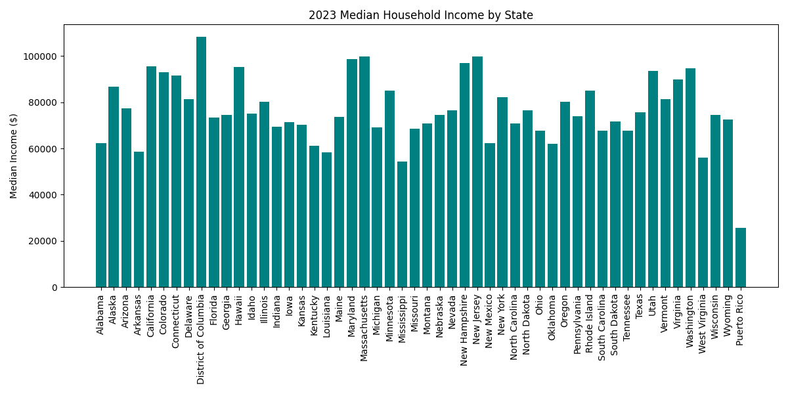
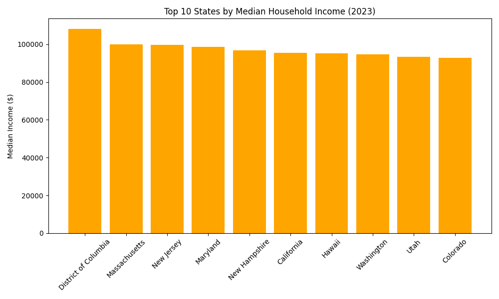

# Census Income Analysis

Median household income by state using ACS 2023 data.

- **Author**: Raymond Cirko
- **Files**:
  - `Census Income Analysis.ipynb`: Notebook with code, outputs, and plots (all states + top 10).
  - `income_by_state_2023.csv`: Source data.
  - `income_by_state.png`: Bar chart of all states.
  - `top_10_income_by_state.png`: Bar chart of top 10 states.
- **Key Findings**:
  - Average median income: $76,589.52.
  - Top: District of Columbia ($108,210).
  - Bottom: Puerto Rico ($25,621).
- **How to Run**: Open `.ipynb` in Jupyter with Python 3, Pandas, Matplotlib; ensure CSV is in same directory.
- **Source**: [U.S. Census Bureau ACS 2023](https://www.census.gov/programs-surveys/acs).

